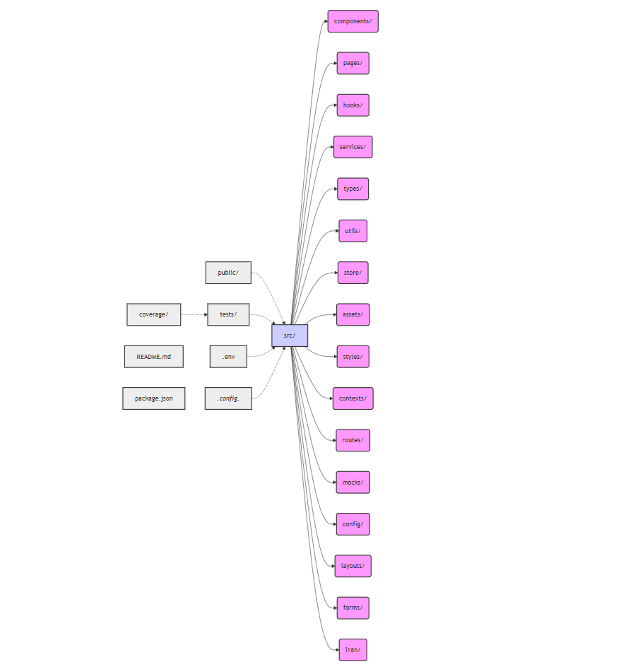

# Fitshop Stock Control UI Best Practices

This document outlines the best practices to follow while developing the StockControlApp ReactJS project. Adhering to these guidelines ensures code quality, organization, team productivity, and maintainability.

## Key Topics

- [**Project Structure**](#project-structure)
- [**Testing**](#testing)
- [**Dependencies**](#dependencies)
- [**Dependency Management**](#dependency-management)
- [**Code Quality and Architecture**](#code-quality-and-architecture)
- [**Team Productivity**](#team-productivity)
- [**Environment Variables**](#environment-variables)
- [**API Services**](#api-services)
- [**Contact Information**](#contact-information)

## Project Architecture

The project follows a component-based architecture with a clear separation of concerns that should be followed by the team. It's not fully implemented, but that's our goal "to be" right now:

**`src/`**: Main Source Directory
- **`components/`**: Reusable UI components.
- **`pages/`**: Page-level components (views).
- **`hooks/`**: Custom React hooks.
- **`services/`**: API and utility services.
- **`types/`**: TypeScript type definitions.
- **`utils/`**: Shared utility functions and helpers.
- **`store/`**: Redux state management (slices, actions, selectors, store configuration).
- **`assets/`**: Static assets (images, fonts, SVGs, etc.).
- **`styles/`**: Global styles, themes, and CSS modules.
- **`contexts/`**: React context providers.
- **`routes/`**: Routing configuration and components.
- **`mocks/`**: Mock data for development and testing.
- **`config/`**: Application configuration files and constants.
- **`layouts/`**: Layout components (e.g., for headers, footers, sidebars).
- **`forms/`**: Reusable form components and logic.
- **`i18n/`**: Internationalization files and configuration.
- **`public/`**: Static assets.
- **`tests/`**: Test files (e.g., `App.test.tsx`, `api.test.tsx`).
- **`coverage/`**: Test coverage reports.
- **`.env`**: Environment variables.
- **`*.config.*`**: Configuration files (Vite, Jest, ESLint, Prettier).
- **`README.md`**: Project documentation.
- **`package.json`**: Project dependencies.

## Testing

- **Coverage Goals:** Must be 90%+ statement, branch, function, and line coverage for all files.
- **Testing Library:** Use `@testing-library/react` for component testing.
- **Jest:** Utilize Jest as the test runner.
- **Mocking:** Use `jest.mock()` for mocking external dependencies and API calls.
- **Test Organization:** Keep test files (`.test.tsx`) alongside the corresponding component files.
- **Test Scenarios:** Cover all possible scenarios, including edge cases and error handling.
- **Component Isolation:** Test components in isolation, mocking dependencies as needed.
- **API Tests:** Thoroughly test API service (`api.ts`) for all endpoints and error handling.
- **Setup Tests:** Use `setupTests.ts` to configure Jest and add global mocks or setup.

## Dependencies

- **Used Packages**
  - `react-feather` for consistent and lightweight icons.
  - `date-fns` for robust and efficient date manipulation.
  - `axios` for API calls.
  - `vite` for building and serving the app.
  - `typescript` for static typing.
  - `eslint` and `prettier` for code linting and formatting.

## Dependency Management

- **Bundle Size:** Carefully consider the impact of new packages on bundle size.
- **Security:** Ensure that new packages are secure and well-maintained. Always use trusted sources and run `npm audit` to check for vulnerabilities.
- **Alternatives:** Explore built-in browser APIs or lightweight alternatives before adding new dependencies.
- **Version Control:** Pin dependencies to specific versions to avoid unexpected breaking changes.

## Code Quality and Architecture

- **Component Reusability:** Design components to be reusable across the application.
- **Separation of Concerns:** Keep components focused on specific tasks and avoid mixing logic.
- **State Management:** Use React's built-in state management (`useState`, `useContext`) for local component state. When our app gets more complex, let's use `Redux Toolkit` for global state management to avoid prop drilling. For example:
    We can organize our Redux state into "slices," each representing a specific feature or domain within the application. Slices are located in the `src/store/slices/` directory. For example:
        * `src/store/slices/reportSlice.ts`: Manages the state related to stock reports.
        * `src/store/slices/transactionSlice.ts`: Manages the state related to transactions.
    Each slice file should export:
        * A `slice` object created using `createSlice` from Redux Toolkit.
        * Action creators generated by `createSlice`.
        * The slice's reducer as the default export.
        * Selectors to access specific parts of the slice's state.

### Async Actions and Thunks
For handling asynchronous actions (like API calls), we use Redux Thunks placed within the respective slice files.
### Store Configuration
The global Redux store is configured in src/store/store.ts using configureStore from Redux Toolkit. The store combines all slice reducers.
- **TypeScript:** Leverage TypeScript's type system to improve code reliability and maintainability.
- **Code Formatting:** Use Prettier to enforce consistent code formatting.
- **Code Linting:** Use ESLint to enforce code style and catch potential errors.
- **Error Handling:** Implement robust error handling for API calls and user interactions.
- **Accessibility:** Follow accessibility guidelines to ensure the application is usable by everyone.
- **Performance:** Optimize components for performance, minimizing unnecessary renders and API calls.
- **Documentation:** Document components and services with clear comments and JSDoc annotations.

## Team Productivity

- **Onboarding:** New team members should read our onboard documentation, setup instructions, and best practices to get familiar with the project and its structure, and do the trainings on time. They should also be assigned a buddy for the first few weeks to help them understand the codebase and answer any questions they may have.
- **Code Reviews:** Conduct thorough code reviews to ensure code quality and knowledge sharing.
- **Pair Programming:** Use pair programming for complex tasks or to onboard new team members.
- **Communication:** Maintain clear and consistent communication within the team, especially regarding relevant code changes and architectural decisions. Contact our team lead (Daniel Carneiro) for more information.
- **Agile Practices:** Follow agile methodologies for project management and development.
- **Continuous Integration/Continuous Deployment (CI/CD):** Set up and maintain CI/CD pipelines working well to automate testing and deployment.
- **Style Guide:** Create and follow a style guide/design system to keep a consistent visual and code style.
- **Component Library:** Create and use our component library, that could be imported to new projects, to keep a consistent visual style, and also ease and fasten the development of new projects.
- **Documentation:** Maintain clear and up-to-date documentation for the project in Confluence, including setup instructions, architecture decisions, and API documentation. Post any relevant new documentation on our communication channels (Teams, e-mail).

## Environment Variables

- **`.env` Files:** Use `.env` files to store environment variables.
- **Security:** Avoid committing sensitive information to version control.
- **Naming Conventions:** Use clear and consistent naming conventions for environment variables.

## API Services

- **Abstraction:** Abstract API calls into dedicated services (`api.ts`, `ReportService.ts`).
- **Error Handling:** Implement error handling for API calls, including retries and fallbacks.
- **Base URL:** Store the API base URL in an environment variable.
- **Data Transformation:** Transform API responses into the required data format.

## Contact Information

For any questions or information, contact team lead Daniel Carneiro.